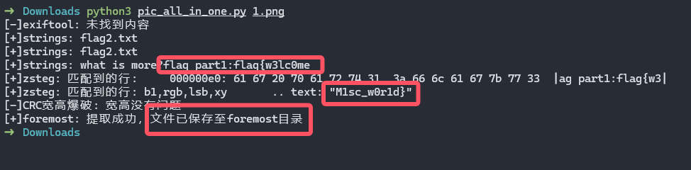

# Picture-All-In-One
### CTF-Misc 图片隐写一把梭脚本

本项目持续更新！！！（如果作者在役且有空）

#### 运行环境

Linux系统，推荐使用WSL安装Ubuntu，且实现完成以下配置

- exiftool
- zsteg
- foremost
- strings
- F5-steganography
- stegpy

#### 未来会加入的功能

- stegsolve
- stegseek
- clocked pixel
- 等等……

我会逐渐加入我在CTF比赛中遇到的常见的所有图片隐写类型

如果有迫切需要加入的功能可以提Issues

一些其他的功能或许会考虑先写在博客上 丢个链接：[C3ngH's B10g](https://c3ngh.top/)

#### 测试用例

可以使用工具一把梭test文件夹内的题目

